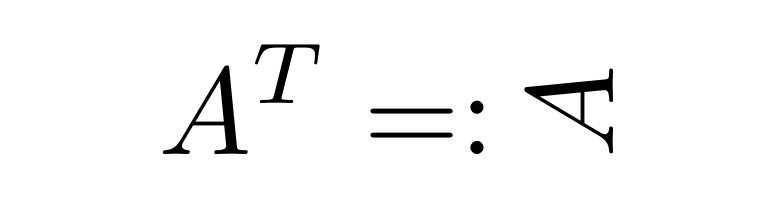
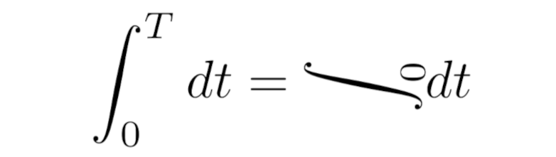

# realtranspose - The REAL way to transpose Matrix

Update: [Now on CTAN!](https://ctan.org/pkg/realtranspose)
Update: [Now avaiable for MiKTeX!](https://miktex.org/packages/realtranspose)

Have you ever thought "*I wish mathematical notation would arrive in the 21st century?*"

Now you can *finally* define a symmetric matrix the right way!



You can even go full apesh\*t-crazy!



Now is your time to do it!

## Usage

It's as easy as `1 succ(1) succ(succ(1))`!
```latex
\usepackage{realtranspose}

\begin{document}
A matrix is symmetric iff
\[ A = \realtranspose{A} \]
\end{document}
```

## Contributing

You have any idea how to extend this joke?

Feel free to either fork it or just open an issue and I'll implement it for you!

## Acknowledgements

- [realhats](https://github.com/mscroggs/realhats) for the idea and much of the Boilerplate

- [Papa Flammy](https://www.youtube.com/channel/UCtAIs1VCQrymlAnw3mGonhw) for all the math ideas

- [This](https://twitter.com/FlammableMaths/status/1293551550179225601) and [that](https://twitter.com/FlammableMaths/status/1281160091845173251) Meme for the inspirations
